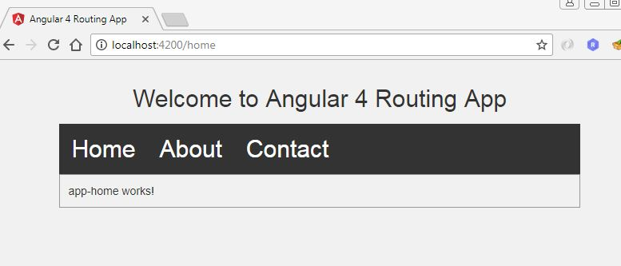
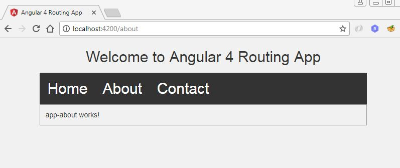
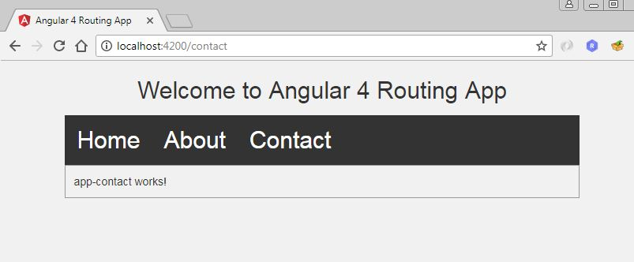

# Angular 4 Routing Example

> This is a basic http routing (url routing) example using angular 4.

## To Run Project
1. Download this repository in workspace

2. Create file ``.editorconfig`` in root folder
```
# Editor configuration, see http://editorconfig.org
root = true

[*]
charset = utf-8
indent_style = space
indent_size = 2
insert_final_newline = true
trim_trailing_whitespace = true

[*.md]
max_line_length = off
trim_trailing_whitespace = false
```

3. Create file ``.angular-cli.json`` in root folder
```JSON
{
  "$schema": "./node_modules/@angular/cli/lib/config/schema.json",
  "project": {
    "name": "router-app"
  },
  "apps": [
    {
      "root": "src",
      "outDir": "dist",
      "assets": [
        "assets",
        "favicon.ico"
      ],
      "index": "index.html",
      "main": "main.ts",
      "polyfills": "polyfills.ts",
      "test": "test.ts",
      "tsconfig": "tsconfig.app.json",
      "testTsconfig": "tsconfig.spec.json",
      "prefix": "app",
      "styles": [
        "styles.css"
      ],
      "scripts": [],
      "environmentSource": "environments/environment.ts",
      "environments": {
        "dev": "environments/environment.ts",
        "prod": "environments/environment.prod.ts"
      }
    }
  ],
  "e2e": {
    "protractor": {
      "config": "./protractor.conf.js"
    }
  },
  "lint": [
    {
      "project": "src/tsconfig.app.json"
    },
    {
      "project": "src/tsconfig.spec.json"
    },
    {
      "project": "e2e/tsconfig.e2e.json"
    }
  ],
  "test": {
    "karma": {
      "config": "./karma.conf.js"
    }
  },
  "defaults": {
    "styleExt": "css",
    "component": {}
  }
}
```

##### Links
> http://localhost:4200


### Output






## Meta

Rutvik Patel - rrpatel003@gmail.com

Distributed under the GPL V3.0 license. See ``LICENSE`` for more information.
